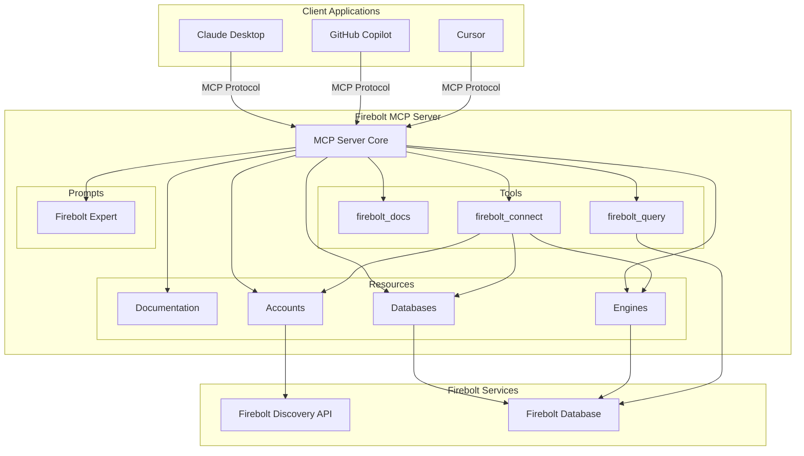
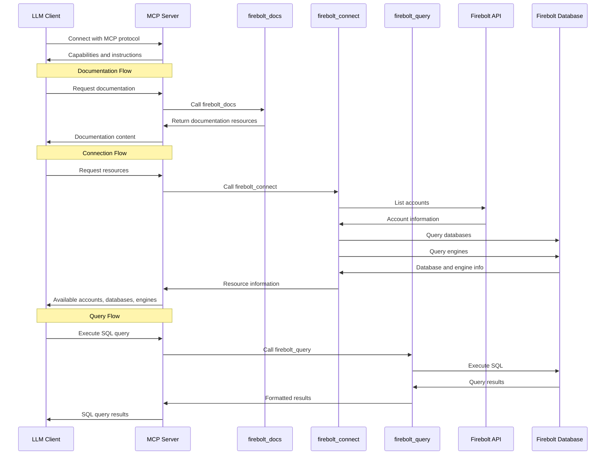
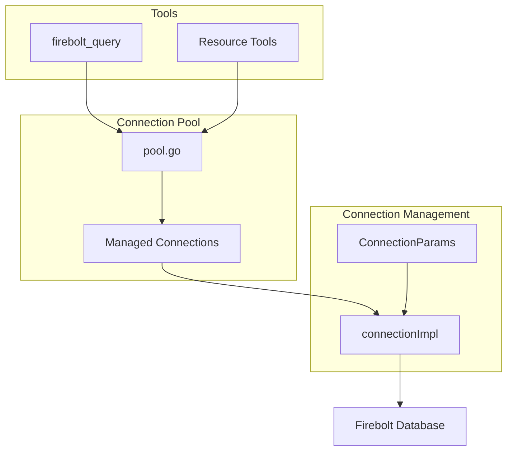

# Firebolt MCP Server: Design Overview

This document provides a detailed technical overview of the Firebolt MCP Server, explaining its architecture, components, and how they interact to enable LLM integration with Firebolt Data Warehouse.

## What is the Firebolt MCP Server?

Firebolt MCP Server is an implementation of the [Model Context Protocol (MCP)](https://modelcontextprotocol.io/) that allows Large Language Models (LLMs) like Claude, GitHub Copilot, and others to directly interact with Firebolt cloud data warehouse. It serves as a bridge between AI assistants and Firebolt's data storage and query capabilities.

## Architecture Overview

## Core Components

### 1. MCP Server

The server component (`pkg/server/server.go`) is the central part of the application that manages communication with LLM clients and orchestrates interactions between tools, resources, and prompts. It implements the Model Context Protocol using the `mark3labs/mcp-go` library.

Key features:
- Supports multiple transport methods (stdio, SSE)
- Handles request routing to appropriate tools and resources
- Manages lifecycle of connections and interactions

### 2. Tools

Tools are executable capabilities exposed to LLMs through the MCP interface:

1. **firebolt_docs** (`pkg/tools/docs.go`)
   - Provides access to Firebolt documentation
   - Returns embedded markdown content for various documentation articles
   - Helps LLMs understand Firebolt concepts, SQL syntax, and best practices

2. **firebolt_connect** (`pkg/tools/connect.go`)
   - Lists available Firebolt accounts, databases, and engines
   - Requires a "proof" from documentation to ensure the LLM has read basic Firebolt information
   - Enables discovery of resources before executing queries

3. **firebolt_query** (`pkg/tools/query.go`)
   - Executes SQL queries against Firebolt databases
   - Manages connections to the specified account, database, and engine
   - Returns query results in JSON format

### 3. Resources

Resources are information objects that can be accessed by the LLM:

1. **Documentation Resources** (`pkg/resources/docs.go`)
   - Provides markdown documentation about Firebolt
   - Includes an overview, detailed reference, and specialized articles

2. **Account Resources** (`pkg/resources/accounts.go`)
   - Represents Firebolt accounts the user has access to
   - Contains account metadata like name and region

3. **Database Resources** (`pkg/resources/databases.go`)
   - Represents databases within Firebolt accounts
   - Includes metadata about each database

4. **Engine Resources** (`pkg/resources/engines.go`)
   - Represents compute engines within Firebolt accounts
   - Contains information about engine type, status, and configuration

### 4. Clients

The MCP server includes specialized clients to interact with Firebolt services:

1. **Database Client** (`pkg/clients/database/`)
   - Manages connections to Firebolt databases
   - Handles connection pooling for different account/database/engine combinations
   - Executes SQL queries and formats results

2. **Discovery Client** (`pkg/clients/discovery/`)
   - Communicates with Firebolt API to discover available accounts
   - Handles OAuth2 authentication and API communication

## Data Flow and Interactions

## Implementation Details

### Authentication and Security

The server authenticates with Firebolt using OAuth2 client credentials (client ID and client secret). It obtains a token from Firebolt's identity service and uses it for all API calls and database connections.

Security features:
- No credential storage - credentials are passed as environment variables or command line arguments
- Connection pool management to avoid credential leakage
- Secure transport options (stdio, SSE)

### Connection Pooling

The server implements a connection pool for different Firebolt account/database/engine combinations. This optimizes for:
- Reusing connections when possible
- Properly managing resources across multiple requests
- Handling concurrent queries efficiently

### Documentation Integration

The server embeds Firebolt documentation directly in the binary, making it available offline and ensuring fast access:
- Documentation is structured as markdown files
- Special articles (overview, proof, reference) are embedded with the `go:embed` directive
- Additional documentation is stored in the filesystem and can be updated independently

### Error Handling and Logging

The server implements comprehensive error handling and structured logging:
- All errors are properly wrapped with context
- Structured logging using `log/slog`
- Unified error handling patterns across components

## Starting Points for Understanding the Code

1. **Main Application Entry Point**: `cmd/firebolt-mcp-server/main.go`
2. **Server Core Implementation**: `pkg/server/server.go`
3. **Tool Implementations**:
   - `pkg/tools/docs.go`
   - `pkg/tools/connect.go`
   - `pkg/tools/query.go`
4. **Resource Handlers**:
   - `pkg/resources/docs.go`
   - `pkg/resources/accounts.go`
   - `pkg/resources/databases.go`
   - `pkg/resources/engines.go`
5. **Database Connection**: `pkg/clients/database/pool.go` and `pkg/clients/database/connection.go`

## Conclusion

The Firebolt MCP Server provides a robust implementation of the Model Context Protocol that allows LLMs to interact with Firebolt Data Warehouse. By exposing tools, resources, and prompts through a standardized interface, it enables AI assistants to query data, understand documentation, and provide insights based on Firebolt's capabilities.

The modular architecture ensures clear separation of concerns, with distinct components handling server communication, resource discovery, documentation access, and query execution. This design facilitates maintenance, testing, and future expansion of the server's capabilities.
